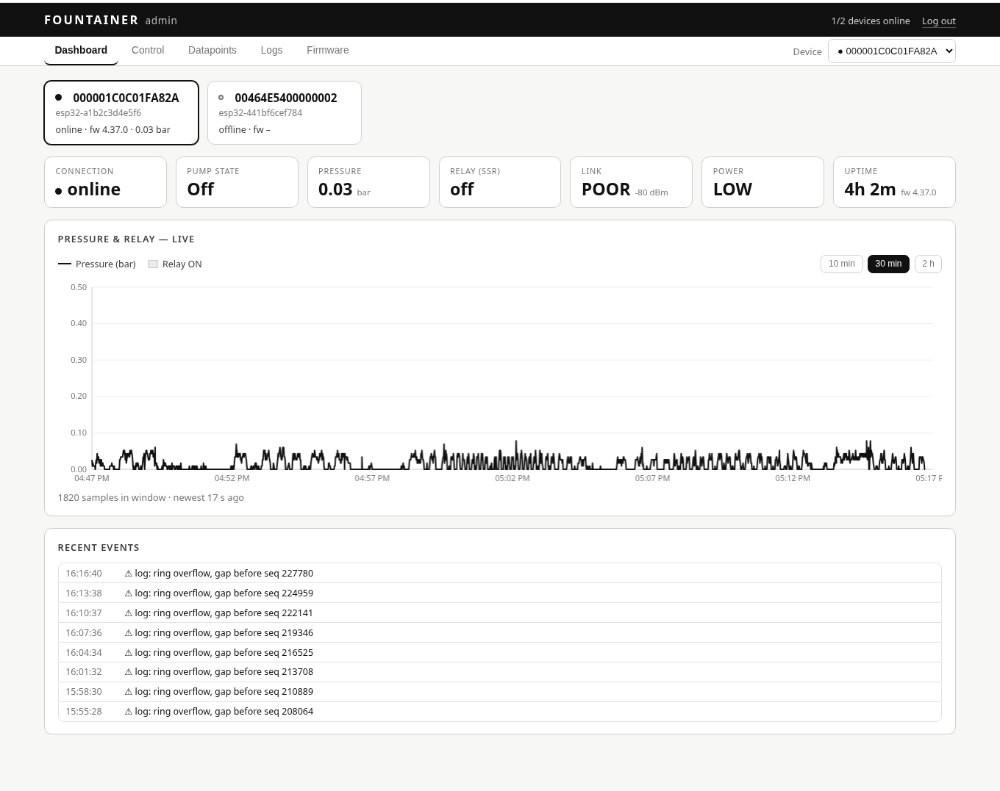
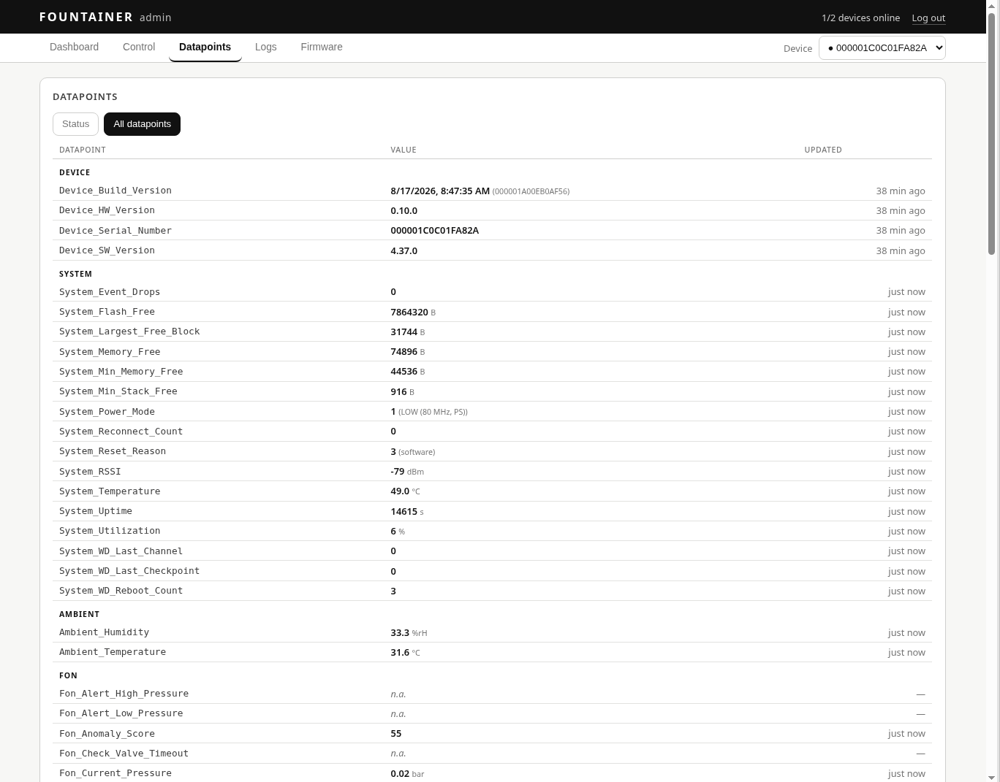

# Fountain v2.2 — Linux server

Server-side implementation of the **WebSocket protocol v2.2** (Fountain) built on
the `serverside_protocol` framework (included here as the package
`fountain_proto/`). The server terminates the WebSocket handshake, negotiates
HMAC authentication (scope=`control`), verifies/signs messages and implements
the RPCs described in the protocol as well as **OTA firmware updates**.

> The counterpart (ESP32-S3 firmware) lives in the sister repo
> `../fountainer_firmware`; the golden auth test vector in
> `tests/test_auth_golden.py` guarantees byte-exact interoperability of both sides.

## Architecture

```
start.sh / stop.sh          start/restart the stack via Docker, or shut it down cleanly
run_server.py                entry point (reads ENV, starts everything)
server/
  app.py        FountainAppServer  – wires protocol + OTA + telemetry + control API
  web.py        AdminWeb            – admin web UI (login + RPC buttons), aiohttp
  static/       index.html / login.html – dashboard & login
  ota.py        FirmwareStore       – scans FIRMWARE_UPDATES, size/crc32/sha256, version selection
  http_firmware.py  FirmwareHTTPServer – serves the *.bin over HTTP (OTA download)
fountain_proto/             embedded framework (envelope, auth, session, server, catalog)
devices.json                device registry: device_id -> bearer token + auth keys (kid)
FIRMWARE_UPDATES/           OTA images (*.bin)
DEVICE_LOGS/                device logs pulled by the log poller (JSONL, per boot_id)
esp_client_simulator.py     real v2.2 device simulator (for tests / manual use)
local_maintenance_client.py maintenance access to the firmware's local WSS server
                            (port 4443, mTLS): --read/--full/--write/--command/--history
tests/                      pytest: golden vector, integration, OTA, log pull, history
../DO_NOT_COMMIT/CA/        testbed PKI (root CA, server/device certificates) — not in the repo
```

The only change to the framework is an additive hook `on_ota_check`
(analogous to the existing `on_connect`) so the application can answer the
session proof (`ota_check`) with `ota_available` **or** `ota_none`.

## Implemented RPCs / messages

| Direction | Message | Auth | Implementation |
|----------|-----------|------|-----------|
| Handshake | `hello` / `hello_ack` | – | negotiation (protocol + HMAC scope + nonces), bearer check on upgrade |
| c2s | `ota_check` (session proof) | signed | verification; reply `ota_available`/`ota_none` |
| s2c | `ota_available` | **signed** | server-attested `size`/`crc32`/`sha256` + URL |
| s2c | `ota_none` | – | no update |
| s2c | `command` | **signed** | `command()` → waits for `command_result` |
| c2s | `command_result` | – | response correlation (in_reply_to) |
| s2c | `dp_write` | **signed** | `dp_write()` → waits for `dp_write_result` |
| c2s | `dp_write_result` | – | response correlation |
| s2c | `dp_read` | – | `dp_read()` → waits for `dp_report` |
| c2s | `dp_report` | – | telemetry (periodic / on-change / response) |
| c2s | `heartbeat` | – | liveness, stored in the device shadow |
| c2s | `device_alert` | – | unsolicited alert |
| c2s | `ota_status` | – | OTA progress/result |
| s2c | `ota_cancel` | **signed** | (can be sent by the server) |
| s2c | `log_read` / `log_read_prev` / `log_ack_prev` | **signed** | pull the structured device log (current/previous boot) |
| c2s | `log_batch` / `log_ack_result` | – | log records + bookkeeping (boot_id, seq window, drops) |
| s2c | `history_read` | **signed** | pull the device's 1 Hz pressure history (`since_seq` cursor) |
| c2s | `history_batch` | – | samples `[seq, ts_ms, mbar, status]` + ring metadata |

Authentication follows the internal `AUTH-CONTRACT.md` spec byte for byte
(not included in this repository); the **golden test
vector** is reproduced in `tests/test_auth_golden.py` and guarantees
interoperability with the ESP32 side (`esp_firmware`).

## Server pull: device log & pressure history

Two poller tasks are started per connected device:

* **Log poller** (`_poll_logs`): pulls the structured device log incrementally
  via `log_read` (2 s cadence during the first minute, then 60 s), stores the
  records as JSONL under `DEVICE_LOGS/<device_id>/<boot_id>.jsonl` and in the UI
  shadow. After a crash/watchdog reboot the previous boot's log is recovered
  via `log_read_prev`/`log_ack_prev`. The firmware stores **all log levels**
  (including DEBUG/TRACE); filtering happens on retrieval (`min_level`).
* **History poller** (`_poll_history`): pulls the 1 Hz pressure history right
  after connect and then every 30 s (device ring: 100 samples ≈ 100 s horizon).
  The `since_seq` cursor lives in the device state and survives reconnects; a
  boot_id change resets it. Samples are deduplicated by seq, converted from
  mbar to bar, mapped to server time via a wall-clock anchor (`t = now − (now_ms −
  ts_ms)`) and **backfilled into the chart history sorted by t** — the graph
  fills connectivity gaps of up to ~100 s without holes. All samples are
  plotted (including those with a sensor-error status) so every device shows the
  same continuous curve; the status stays attached to the sample. The web UI
  polls `/api/history` with the insertion-id filter `?since_i=`, so backfilled
  older samples arrive as well. Old firmware without `history_read` ignores the
  request — the poller then ends via timeout (backwards compatible).

## Quick start (production/testbed operation, Docker + mTLS)

```bash
bash start.sh   # builds the image, starts the container, checks all endpoints
                # and waits until the Fountainer has connected.
bash stop.sh    # shuts down container + network cleanly (no autostart afterwards)
```

`start.sh` is idempotent: if the stack is already running, it is restarted.
Prerequisites (checked by the script): testbed PKI under
`../DO_NOT_COMMIT/CA`, `.env` with `TLS_KEY_PASSWORD`, and the host needs the
IP **192.168.1.12** — the ESP32 is provisioned to exactly this address
(`SERVER_HOST` in the firmware, SAN in the server certificate).

## Development without Docker (plaintext WS, local only)

```bash
python3 -m venv .venv && . .venv/bin/activate
pip install -r requirements.txt

# start the server (plaintext WS on :8443, web UI on :8010, firmware HTTP on :8080)
python run_server.py
```

In a second terminal start the device simulator:

```bash
# plaintext (local dev server):
python esp_client_simulator.py --uri ws://127.0.0.1:8443/ws

# against the Docker stack (wss:// + mTLS like the real device):
CA=../DO_NOT_COMMIT/CA
python esp_client_simulator.py --uri wss://127.0.0.1:8443/ws \
  --ca $CA/root/certs/ca.crt.pem \
  --cert $CA/esp32/esp32.crt.pem --key $CA/esp32/esp32.key.plain.pem
```

### Admin web UI (buttons for the RPCs)

Reachable after start at **http://localhost:8010** (login: `admin` / `admin`,
changeable via `FOUNTAIN_ADMIN_USER`/`FOUNTAIN_ADMIN_PASSWORD`).



*Dashboard — device overview with status tiles (connection, pump state,
pressure, relay, link quality, power mode, uptime), 1 Hz pressure curve from
the device history (10 min / 30 min / 2 h) and the most recent events.*

For every connected device there are clickable buttons that trigger exactly the protocol RPCs:

| Button | RPC (s2c) | Effect |
|--------|-----------|---------|
| On / Off / Auto / Manual | `command` (signed) | `set_state` + `target_state` = `On` / `Off` / `Auto` / `Manual` |
| Restart | `command` (signed) | `restart` |
| On for duration (×30 s) | `command` (signed) | `turn_on_duration` + `duration_steps` |
| Read snapshot | `dp_read` | requests a `dp_report`, shows the datapoints |
| dp_write (field + value) | `dp_write` (signed) | writes a config datapoint, shows the `readback` |
| ota_cancel | `ota_cancel` (signed) | aborts a running OTA |

The page also shows the online/authenticated status, latest telemetry
(`dp_report`/`heartbeat`), `ota_status`, alerts and the firmware in `FIRMWARE_UPDATES`
(auto-refresh every 3 s). All control calls run over the signed (scope=control)
server→device path; responses (`command_result`/`dp_write_result`) are displayed.



*Datapoint view — the complete catalog of the selected device (Device, System,
Ambient, Fon, Network, …) with value, unit and time of the last update;
switchable between the status selection and all datapoints.*

### Testing OTA

```bash
# provide a newer image (the version is part of the file name):
cp my_firmware.bin FIRMWARE_UPDATES/fountain-2.1.0.bin

# simulator with an older version -> downloads, checks size/crc32/sha256, reports 'applied':
python esp_client_simulator.py --uri ws://127.0.0.1:8443/ws --fw 1.0.0 --save-dir /tmp/dl
```

### Via Docker (manually, instead of start.sh)

```bash
cp .env.example .env        # check TLS_KEY_PASSWORD; adjust PUBLIC_HOST if needed
docker compose up --build -d
# WSS: :8443, web UI: :8010, firmware HTTPS: :8080, images from ./FIRMWARE_UPDATES
```

The TLS/mTLS configuration (PKI mount `../DO_NOT_COMMIT/CA` → `/ca` and the
`TLS_*` variables) is already in `docker-compose.yml`.

## Tests

```bash
pip install -r requirements.txt
python -m pytest tests/ -q
```

Covers: golden auth vector + sign/verify/tamper + anti-replay; complete
handshake with signed `command`/`dp_write` and `dp_read`/`dp_report`; rejected
bearer token; **OTA end-to-end** (offer → HTTP download → hash check → `applied`)
plus "no update at equal version"; **log pull end-to-end** (poller, JSONL,
dedup, previous-boot recovery) and **pressure history end-to-end**
(backfill, seq dedup, wall-clock anchor, `?since_i=` filter).

## Device registry (`devices.json`)

```json
{
  "esp32-a1b2c3d4e5f6": {
    "serial": "000001C0C01FA82A",
    "bearer_token": "testbed-bearer-token-rotate-me",
    "auth_keys": { "1": "000102…1e1f" }
  }
}
```

`bearer_token` protects the WebSocket upgrade; the 32-byte `auth_keys` (per `kid`)
carry the HMAC message authentication. Both are assigned per device; rotation via
additional `kid`s.

New series devices are registered by running
`tools/register_server_devices.py --serial FNT-xxxxxx` in the firmware
repository (`fountainer_firmware`) (strictly additive;
`device_id` scheme **`esp32-<wifi-sta-mac>`**). The registry is read only at
server start — afterwards run `bash start.sh`.

## TLS / mTLS

Set `TLS_CERT`/`TLS_KEY` → WebSocket server and firmware download speak
`wss://` and `https://`. With `TLS_CLIENT_CA` a valid **client certificate is
additionally enforced (mTLS)** — the ESP32 authenticates with its device
certificate. The testbed PKI (dummy certificates, to be replaced later) lives
under `../DO_NOT_COMMIT/CA`; passphrases see `PASSWORDS.md` there.
Independently of that, the authenticity of the OTA metadata is secured by the
**signed `ota_available`**.

## Troubleshooting

* **Device offline, server log shows `HTTP 400 Bad Request` every ~15 s** →
  the container runs without TLS (PKI mount/`TLS_*` variables missing). The
  ESP32 always speaks `wss://` with a client certificate; against a plaintext
  port the handshake already fails (incident 2026-07-24). `bash start.sh`
  checks this up front.
* **Device offline, server log shows no connection attempts at all** → the host
  does not have the IP `192.168.1.12` (the device talks to an address nobody
  answers on). Check with `ip addr`, fix with
  `sudo ip addr add 192.168.1.12/24 dev enp0s3` (incident 2026-08-12).
* Follow the log live: `docker logs -f fountain_server`

## Compatibility

This repo now contains only the v2.2 server, which is compatible with the
current ESP32 firmware. The expected device endpoint is
`wss://192.168.1.12:8443/ws` (mTLS) with `hello`/`hello_ack`/`ota_check` and HMAC auth.
The admin web UI runs separately on `http://<server>:8010/`.

## License

This project is released under the [MIT License](LICENSE.md).

Copyright (c) 2026 Sascha G. Eurich, Melowsyne UNIPESSOAL LDA
